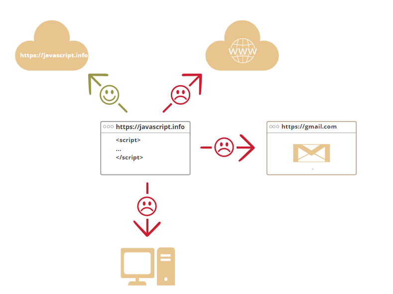

## JavaScript 简介

`JavaScript`是一种脚本语言，下称`Js`，能够直接镶嵌在 HTML 文件中，在页面加载的时候自动运行，不需要编译即可执行。

##  引擎

JavaSript 引擎也称 JavaScript 虚拟机，不同浏览器中的引擎的代号不同：

> - Chrome 和 Opera：V8
> - Firefox：SpiderMonkey
> - IE：Chakra
> - Microsoft Edge：ChakraCore
> - Safari：SquirrelFish

引擎是如何工作的？

- 浏览器中的引擎，被镶嵌在其中，解析 Js 脚本文件
- 引擎将`Js`脚本文件解释执行为底层的机器语言
- 底层硬件执行机器码

## JavaScript 能做什么？

`Js`不提供对内存和 CPU 的访问，是一种较为高级的编程语言，最初只是为了浏览器创建的。浏览器中的`Js`可以做与网页操作、用户交互和 Web 服务器相关的所有事情。Js 的用途取决于它的运行环境。

浏览器中的`Js`可以做的事情有：

> - 在网页中添加新的 HTML，修改网页已有内容和网页的样式。
> - 响应用户的行为，响应鼠标的点击，指针的移动，按键的按动。
> - 向远程服务器发送网络请求，下载和上传文件（所谓的 [AJAX](https://en.wikipedia.org/wiki/Ajax_(programming)) 和 [COMET](https://en.wikipedia.org/wiki/Comet_(programming)) 技术）。
> - 获取或设置 cookie，向访问者提出问题或发送消息。
> - 记住客户端的数据（“本地存储”）。

浏览器中的`Js`不能做的事情有：

>- 网页中的`JavaScript`不能读、写、复制和执行硬盘上的任意文件，不能直接访问`OS`
>- 受限制的文件相关的操作，例如，用 `<input>`标签选择文件
>- 严格的用户许可，不会将转发用户的信息
>- “同源策略”，即两个标签页必须都包含处理这个问题的特定 JavaScipt 代码，才会允许数据交换
>- 受`HTTP`协议的影响，JavaScript 能轻易地同当前标签页与所属服务器进行通信，但从其他（网站、域、服务器）的通信能力被削弱了，为了保护用户的数据安全

浏览器外的 Js 能做的事情更多一些，拥有的权限也更多，所以，在一些浏览器上通常会**提供允许扩展权限的插件**。
